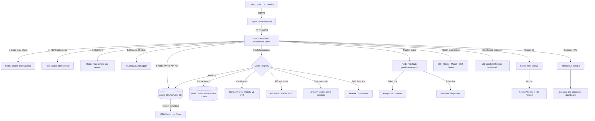

# Enterprise-Grade Car Price Prediction API

---

## 0. Project Goal

Build a production-grade, CV-worthy FastAPI microservice for car price prediction that demonstrates senior backend engineering skills: security, observability, ML serving, event-driven architecture, multi-tenancy, developer experience, and deployment. Every design decision should reflect what a FAANG-level backend engineer would do.

---

## 1. Technology Stack

```
Runtime         : Python 3.11+
Framework       : FastAPI + Uvicorn + Gunicorn
Database        : SQLite (dev) / PostgreSQL (prod-switchable) via async SQLAlchemy 2.0
Cache + Queue   : Redis 7 (rate limiting, cache, pub/sub, brute force, TimeSeries)
ML              : scikit-learn RandomForest + joblib
Task Queue      : Celery + Redis broker
Reverse Proxy   : Nginx
Observability   : Prometheus + Grafana (with pre-committed dashboard JSON)
Logging         : structlog (JSON structured logs)
Testing         : pytest + httpx (async) + Locust (load testing)
Containerization: Docker + Docker Compose
CI/CD           : GitHub Actions
Config          : Pydantic Settings v2 + .env files
CLI             : Typer
SDK             : Auto-generated from OpenAPI spec
```

---

## 2. Complete System Architecture



---

## 3. Database Schema (Async SQLAlchemy)

### Table: `users`
- `id` INTEGER PRIMARY KEY AUTOINCREMENT
- `username` VARCHAR UNIQUE INDEX NOT NULL
- `hashed_password` VARCHAR NOT NULL
- `is_active` BOOLEAN DEFAULT TRUE
- `role` VARCHAR DEFAULT 'user'  ← NEW: values: 'user' | 'admin'
- `tenant_id` INTEGER FK → tenants.id  ← NEW: multi-tenancy
- `failed_login_attempts` INTEGER DEFAULT 0  ← NEW: brute force tracking
- `locked_until` DATETIME NULLABLE  ← NEW: lockout timestamp

### Table: `tenants`  ← NEW: multi-tenancy
- `id` INTEGER PRIMARY KEY AUTOINCREMENT
- `name` VARCHAR UNIQUE NOT NULL
- `rate_limit_per_minute` INTEGER DEFAULT 10  ← per-tenant rate limit
- `allowed_model_version` VARCHAR DEFAULT 'v1'  ← tenant-specific model
- `is_active` BOOLEAN DEFAULT TRUE

### Table: `api_keys`
- `id` INTEGER PRIMARY KEY AUTOINCREMENT
- `user_id` INTEGER FK → users.id
- `tenant_id` INTEGER FK → tenants.id  ← NEW
- `key_hash` VARCHAR UNIQUE INDEX NOT NULL  ← CHANGED: store HMAC hash, not raw key
- `name` VARCHAR
- `scopes` VARCHAR DEFAULT 'predict:read'  ← NEW: comma-separated scopes
- `allowed_ips` VARCHAR NULLABLE  ← NEW: IP allowlist (comma-separated CIDRs)
- `is_active` BOOLEAN DEFAULT TRUE
- `created_at` DATETIME DEFAULT UTC_NOW
- `last_used_at` DATETIME NULLABLE  ← NEW

### Table: `prediction_logs`
- `id` INTEGER PRIMARY KEY AUTOINCREMENT
- `user_id` INTEGER FK → users.id NULLABLE
- `api_key_id` INTEGER FK → api_keys.id NULLABLE
- `tenant_id` INTEGER FK → tenants.id NULLABLE  ← NEW
- `model_version` VARCHAR
- `ab_group` VARCHAR NULLABLE  ← NEW: 'control' | 'treatment'
- `features_hash` VARCHAR (SHA256)
- `prediction_result` FLOAT
- `confidence_score` FLOAT NULLABLE  ← NEW: model confidence
- `is_anomaly` BOOLEAN DEFAULT FALSE  ← NEW: anomaly flag
- `latency_ms` FLOAT
- `cache_hit` BOOLEAN DEFAULT FALSE  ← NEW
- `hmac_chain` VARCHAR  ← NEW: tamper detection chain
- `timestamp` DATETIME DEFAULT UTC_NOW

### Table: `webhooks`  ← NEW
- `id` INTEGER PRIMARY KEY AUTOINCREMENT
- `user_id` INTEGER FK → users.id
- `url` VARCHAR NOT NULL
- `events` VARCHAR DEFAULT 'prediction.complete'
- `secret` VARCHAR  ← HMAC signing secret for webhook payload
- `is_active` BOOLEAN DEFAULT TRUE

### Table: `model_metrics`  ← NEW
- `id` INTEGER PRIMARY KEY AUTOINCREMENT
- `model_version` VARCHAR
- `recorded_at` DATETIME
- `avg_confidence` FLOAT
- `prediction_count` INTEGER
- `drift_score` FLOAT  ← KL divergence from training distribution

---

## 4. API Endpoints — Complete List

### Auth
- `POST /api/v1/auth/register` — Register user (with tenant assignment)
- `POST /api/v1/auth/login` — Returns access_token (15min) + sets refresh_token HttpOnly cookie
- `POST /api/v1/auth/refresh` — Rotate refresh token, return new access_token
- `POST /api/v1/auth/logout` — Blacklist refresh token in Redis

### API Keys
- `POST /api/v1/keys` — Create scoped API key (scopes: predict:read, explain:read, admin:write)
- `GET /api/v1/keys` — List user's keys
- `DELETE /api/v1/keys/{key_id}` — Revoke key

### Prediction
- `POST /api/v1/predict` — Single prediction (header: X-Model-Version, defaults v1)
- `POST /api/v1/predict/batch` — Batch prediction (up to 100 items)  ← NEW
- `POST /api/v1/predict/explain` — XAI explainability for single prediction
- `POST /api/v1/predict/shadow` — Force shadow mode comparison (admin only)  ← NEW

### Analytics & Admin
- `GET /api/v1/analytics/dashboard` — Aggregated KPIs: top brands, price distribution, peak hours
- `GET /api/v1/analytics/trends` — Redis TimeSeries: brand price trend over time  ← NEW
- `GET /api/v1/admin/model-metrics` — Cache hit rate, latency percentiles, prediction distribution
- `POST /api/v1/admin/retrain` — Queue async retrain job via Celery
- `POST /api/v1/admin/reload/{version}` — Hot-reload specific model version in-memory
- `GET /api/v1/admin/drift` — Current drift score per model version  ← NEW
- `GET /api/v1/admin/ab-results` — A/B test performance comparison  ← NEW

### Developer Experience
- `GET /api/v1/benchmark` — Run 100 parallel predictions, return p50/p95/p99 latency + throughput  ← NEW
- `GET /api/v1/health` — Full diagnostic: DB + Redis + models + drift status
- `GET /api/v1/status` — Public uptime page (no auth)  ← NEW

### Webhooks
- `POST /api/v1/webhooks` — Register webhook URL + event types  ← NEW
- `GET /api/v1/webhooks` — List user's webhooks
- `DELETE /api/v1/webhooks/{id}` — Remove webhook

---

## 5. Security Architecture

### JWT Strategy
- Access token: 15-minute expiry, signed with RS256 (asymmetric)  ← CHANGED from HS256
- Refresh token: 7-day expiry, stored as HttpOnly SameSite=Strict cookie
- Refresh token rotation: old token blacklisted in Redis on each refresh
- Token payload includes: user_id, tenant_id, role, scopes

### API Key Security
- On creation: generate 32-byte random key, return raw value ONCE to user
- Store: HMAC-SHA256(key, server_secret) in DB — raw key never persisted
- Verification: re-derive HMAC on each request, compare stored hash
- Scope check: middleware validates key scope matches endpoint requirement
- IP allowlist: if configured, reject requests from non-whitelisted IPs

### Brute Force Protection
- Track failed login attempts per username in Redis with TTL
- After 5 failures: lock account for 15 minutes (stored in `locked_until`)
- Return 429 with Retry-After header during lockout

### Audit Log Tamper Detection
- Each prediction log row includes `hmac_chain = HMAC(prev_row_hmac + current_row_data)`
- `/api/v1/admin/audit/verify` endpoint walks chain and detects tampering

### Pydantic SecretStr
- All secrets (jwt_secret_key, redis_password, db_password) use `SecretStr`
- Never logged, never included in `__repr__` or error traces

---

## 6. ML Serving Architecture

### Model Registry
- Models stored in `static/models/car_v1.joblib`, `car_v2.joblib`
- Loaded into `app.state.models: dict[str, Pipeline]` at startup
- Model selection: `X-Model-Version` header → defaults to tenant's `allowed_model_version`

### A/B Testing
- Traffic split configurable (default 80% v1 / 20% v2)
- Split decision made per-request using consistent hashing on user_id (same user always gets same group)
- Group recorded in prediction_logs as `ab_group`
- Results compared via `/api/v1/admin/ab-results`

### Shadow Mode
- When enabled, every v1 prediction also runs v2 silently
- v2 result is NOT returned to user — only logged for comparison
- Enables safe validation of new model before promoting

### Feature Drift Detection
- At startup, load training feature distributions (mean, std per feature) from `static/drift_baseline.json`
- On each prediction, compute per-feature Z-score
- If average Z-score > threshold (default 2.5): log drift event, increment Prometheus counter
- `/api/v1/admin/drift` returns current drift score and which features are drifting

### Model Confidence Scoring
- For RandomForest: use `predict_proba` max probability as confidence score
- Predictions with confidence < 0.6 flagged in logs and response

### Anomaly Detection
- Rule-based: if predicted price > mean + 3*std of training prices → flag as anomaly
- Anomaly predictions still returned but include `"is_anomaly": true` in response

### XAI Explainability
- Use `feature_importances_` from RandomForest
- Scale by input deviation from training mean to get local importance
- Return ranked dict: `{"engine_size": 0.45, "year": 0.25, "mileage": -0.15}`

### Zero-Downtime Hot Reload
- Celery worker trains new model, saves to temp path
- On success: atomically replace `app.state.models[version]` in-memory
- No server restart required

---

## 7. Caching Strategy

- Cache key: `SHA256(sorted(features.items())):model_version:tenant_id`
- TTL: 300 seconds (configurable per tenant)
- On cache hit: return immediately, log `cache_hit=True`, skip ML inference
- Cache invalidation: on model retrain, flush all keys for that model version
- Cache compression: msgpack serialize prediction result before storing in Redis

---

## 8. Rate Limiting

- Implementation: Redis sliding window counter (more accurate than fixed window)
- Key: `ratelimit:{tenant_id}:{user_id or api_key_id}`
- Limit: configurable per tenant (default 10 req/min)
- On exceed: return 429 with headers: `X-RateLimit-Limit`, `X-RateLimit-Remaining`, `Retry-After`

---

## 9. Event-Driven Architecture

### Redis Pub/Sub Channels
- `prediction.complete` — published after every successful prediction
- `model.retrained` — published when Celery retraining completes
- `drift.detected` — published when drift score exceeds threshold

### Prediction Event Payload
```json
{
  "event": "prediction.complete",
  "prediction_id": 1234,
  "user_id": 42,
  "tenant_id": 1,
  "model_version": "v1",
  "ab_group": "control",
  "brand": "Toyota",
  "predicted_price": 850000,
  "confidence": 0.87,
  "cache_hit": false,
  "latency_ms": 14.2,
  "timestamp": "2024-01-01T12:00:00Z"
}
```

### Consumers (background async tasks)
- Analytics Consumer: aggregates events into Redis TimeSeries
- Webhook Dispatcher: POSTs signed payloads to registered webhook URLs with retry logic (3 attempts, exponential backoff)

---

## 10. Observability

### Structured Logging (structlog)
Every log entry is JSON with:
- `request_id` (UUID injected by middleware)
- `user_id`, `tenant_id`
- `endpoint`, `method`, `status_code`
- `latency_ms`
- `model_version`, `cache_hit` (on prediction routes)

### Prometheus Metrics
System metrics (via `prometheus-fastapi-instrumentator`):
- HTTP request latency histogram by endpoint + status
- Active connections gauge

Custom business KPI metrics:
- `car_predictions_by_brand_total` Counter (label: brand, tenant_id, model_version)
- `avg_predicted_car_price` Gauge (running average, label: tenant_id)
- `cache_hit_total` Counter (label: model_version)
- `cache_miss_total` Counter (label: model_version)
- `model_drift_score` Gauge (label: model_version, feature)
- `prediction_confidence_histogram` Histogram (label: model_version)
- `ab_test_prediction_total` Counter (label: model_version, ab_group)
- `brute_force_attempt_total` Counter (label: endpoint)
- `webhook_dispatch_total` Counter (label: status: success/failure)

### Grafana Dashboard
- Pre-committed `grafana/dashboards/car_api.json`
- Auto-imported via Grafana provisioning in Docker Compose
- Panels: request rate, error rate, latency p95, cache hit rate, price drift, A/B comparison, brand demand heatmap

### Prometheus Alerting Rules
Pre-committed `prometheus/alerts.yml`:
- Alert if p95 latency > 500ms for 2 minutes
- Alert if error rate > 5% for 1 minute
- Alert if drift_score > 3.0 for any model
- Alert if cache hit rate drops below 20%

### Benchmark Endpoint (`GET /api/v1/benchmark`)
Runs 100 parallel async predictions with synthetic data, returns:
```json
{
  "p50_latency_ms": 12,
  "p95_latency_ms": 34,
  "p99_latency_ms": 67,
  "throughput_rps": 847,
  "cache_hit_rate": 0.73,
  "model_version": "v1"
}
```

---

## 11. Multi-Tenancy

- Every user belongs to a tenant (`tenant_id` on all tables)
- Data isolation: all DB queries scoped by `tenant_id` (SQLAlchemy query filter always applied)
- Rate limit isolation: Redis key includes `tenant_id`
- Cache isolation: cache key includes `tenant_id`
- Model isolation: tenant can be pinned to specific model version
- Admin of tenant A cannot see tenant B's data

---

## 12. Middleware Stack (applied in order)

1. `RequestIDMiddleware` — inject UUID `X-Request-ID` header, bind to structlog context
2. `GZipMiddleware` — compress responses > 1KB
3. `CORSMiddleware` — configurable origins per environment
4. `BruteForceMiddleware` — check Redis lockout before auth
5. `AuthMiddleware` — validate JWT or API key, inject user/tenant context
6. `RBACMiddleware` — check role + scope against endpoint requirements
7. `RateLimitMiddleware` — per-tenant sliding window check
8. `TenantIsolationMiddleware` — bind tenant_id to all downstream DB queries

---

## 13. Background Tasks & Celery

### Tasks
- `retrain_model(version, training_data)` — train new model, hot-swap in app.state
- `dispatch_webhook(webhook_id, payload)` — POST to webhook URL with HMAC signature + retry
- `compute_drift_scores()` — scheduled every 1 hour via Celery Beat
- `flush_model_cache(version)` — invalidate Redis cache for model version after retrain

### Celery Config
- Broker: Redis
- Result backend: Redis
- Concurrency: 2 workers
- Task serializer: JSON
- Beat schedule: drift score computation every 3600 seconds

---

## 14. Configuration (Pydantic Settings v2)

```python
class Settings(BaseSettings):
    # App
    app_name: str = "Car Price Prediction API"
    environment: Literal["dev", "staging", "prod"] = "dev"
    debug: bool = False

    # Security
    jwt_secret_key: SecretStr          # RS256 private key PEM
    jwt_public_key: SecretStr          # RS256 public key PEM
    api_key_hmac_secret: SecretStr
    access_token_expire_minutes: int = 15
    refresh_token_expire_days: int = 7

    # Database
    database_url: SecretStr            # sqlite+aiosqlite:/// or postgresql+asyncpg://

    # Redis
    redis_url: SecretStr
    cache_ttl_seconds: int = 300

    # ML
    models_dir: str = "static/models"
    default_model_version: str = "v1"
    ab_test_split: float = 0.8         # fraction going to v1
    shadow_mode_enabled: bool = False
    drift_threshold: float = 2.5
    anomaly_std_multiplier: float = 3.0

    # Rate Limiting
    default_rate_limit_per_minute: int = 10
    brute_force_max_attempts: int = 5
    brute_force_lockout_minutes: int = 15

    model_config = SettingsConfigDict(env_file=".env", secrets_dir="/run/secrets")
```

---

## 15. Testing Strategy

### Unit Tests (`tests/unit/`)
- Auth utilities: password hashing, JWT encode/decode, HMAC key derivation
- ML utilities: feature hash, drift score computation, anomaly detection
- Cache key generation

### Integration Tests (`tests/integration/`)
- All endpoints tested with `httpx.AsyncClient`
- Redis mocked via `fakeredis`
- DB using in-memory SQLite
- Full auth flow: register → login → refresh → logout
- Prediction flow: cache miss → inference → cache hit
- Rate limit enforcement
- RBAC: user cannot access admin endpoints
- Tenant isolation: user from tenant A cannot see tenant B data
- Webhook dispatch: mock HTTP server receives signed payload
- A/B test: verify consistent group assignment per user

### Load Tests (`tests/load/locust_test.py`)
- Simulates 100 concurrent users
- Mixed traffic: 70% predict, 20% explain, 10% analytics
- Reports: requests/sec, p99 latency, error rate
- Assert rate limiter triggers at expected threshold

### Coverage
- Minimum 85% coverage enforced in CI
- Coverage badge auto-generated and committed to README

---

## 16. Developer Experience

### CLI (`cli/main.py` using Typer)
```bash
carapi predict --brand Toyota --year 2020 --mileage 30000 --engine 1800
carapi explain --brand Toyota --year 2020 --mileage 30000 --engine 1800
carapi benchmark --version v1
carapi admin retrain --version v2 --data data/training.csv
carapi keys create --name "my-key" --scopes predict:read
```

### Python SDK (`sdk/`)
Auto-generated from OpenAPI spec using `openapi-python-client`.
Provides typed async client:
```python
from car_api_sdk import CarAPIClient
client = CarAPIClient(api_key="key_xxx", base_url="https://api.example.com")
result = await client.predict(brand="Toyota", year=2020, mileage=30000, engine=1800)
```

### Postman Collection
`docs/postman_collection.json` — committed to repo, importable in one click.
Includes environment variables for local + production.

### Interactive Architecture Page
`docs/architecture.html` — standalone HTML file:
- Clickable components: hover shows tech choice rationale
- Animated request flow showing middleware chain
- No external dependencies (pure HTML/CSS/JS)

### Architecture Decision Records (`docs/decisions/`)
- `ADR-001-redis-over-memcached.md`
- `ADR-002-sqlite-for-dev-postgres-for-prod.md`
- `ADR-003-randomforest-baseline-model.md`
- `ADR-004-jwt-refresh-rotation.md`
- `ADR-005-celery-for-retrain-jobs.md`

---

## 17. Docker Compose Setup

Services:
- `api` — FastAPI app (Gunicorn + Uvicorn workers)
- `celery_worker` — Celery worker for background tasks
- `celery_beat` — Celery Beat scheduler
- `redis` — Redis 7 (cache + queue + pub/sub)
- `nginx` — Reverse proxy (port 80/443)
- `prometheus` — Scrapes `/metrics`
- `grafana` — Pre-loaded dashboard (port 3000)

One-command startup:
```bash
docker-compose up --build
```

All services health-checked. API waits for Redis + DB before starting.

---

## 18. CI/CD (GitHub Actions)

### `.github/workflows/ci.yml`
Triggers on: push to any branch, PR to main

Jobs:
1. `lint` — ruff + black + mypy type check
2. `test` — pytest with coverage report, fail if < 85%
3. `security` — bandit (Python security linter) + safety (dependency CVE check)
4. `build` — Docker build to verify image builds correctly

### `.github/workflows/deploy.yml`
Triggers on: push to main

Jobs:
1. Run full CI pipeline
2. Build + push Docker image to registry
3. SSH deploy to Render / Railway / VPS
4. Post-deploy health check: poll `/api/v1/health` until 200

---

## 19. Deployment

### Target: Render.com (free tier — live URL for CV)
- `render.yaml` committed to repo for one-click deploy
- Redis via Render Redis addon
- Environment variables set via Render dashboard

### Status Page
`GET /api/v1/status` — public, no auth required:
```json
{
  "status": "operational",
  "uptime_seconds": 86400,
  "models_loaded": ["v1", "v2"],
  "db": "healthy",
  "redis": "healthy",
  "version": "1.0.0"
}
```

### UptimeRobot
- Free monitoring pinging `/api/v1/status` every 5 minutes
- README badge: 

---

## 20. Folder Structure

```
car-price-api/
├── app/
│   ├── main.py                    # FastAPI app, lifespan, middleware registration
│   ├── config.py                  # Pydantic Settings
│   ├── database.py                # Async SQLAlchemy engine + session
│   ├── models/                    # SQLAlchemy ORM models
│   │   ├── user.py
│   │   ├── tenant.py
│   │   ├── api_key.py
│   │   ├── prediction_log.py
│   │   ├── webhook.py
│   │   └── model_metrics.py
│   ├── schemas/                   # Pydantic request/response schemas
│   │   ├── auth.py
│   │   ├── prediction.py
│   │   ├── analytics.py
│   │   └── webhook.py
│   ├── routers/                   # FastAPI routers
│   │   ├── auth.py
│   │   ├── keys.py
│   │   ├── predict.py
│   │   ├── admin.py
│   │   ├── analytics.py
│   │   ├── webhooks.py
│   │   └── health.py
│   ├── middleware/
│   │   ├── request_id.py
│   │   ├── auth.py
│   │   ├── rbac.py
│   │   ├── rate_limit.py
│   │   ├── brute_force.py
│   │   └── tenant.py
│   ├── services/
│   │   ├── auth_service.py        # JWT, refresh token rotation
│   │   ├── api_key_service.py     # HMAC key derive + verify
│   │   ├── prediction_service.py  # Cache + inference + audit
│   │   ├── model_registry.py      # Load, hot-swap, A/B, shadow
│   │   ├── drift_service.py       # Drift detection
│   │   ├── xai_service.py         # Feature importance explainability
│   │   ├── analytics_service.py   # Redis TimeSeries + aggregation
│   │   ├── webhook_service.py     # Register + dispatch + HMAC sign
│   │   └── audit_chain.py         # HMAC tamper-detection chain
│   ├── tasks/                     # Celery tasks
│   │   ├── celery_app.py
│   │   ├── retrain.py
│   │   ├── webhook_dispatch.py
│   │   └── drift_compute.py
│   ├── events/                    # Redis Pub/Sub
│   │   ├── publisher.py
│   │   └── consumers/
│   │       ├── analytics_consumer.py
│   │       └── webhook_consumer.py
│   └── metrics/
│       └── prometheus.py          # Custom metric definitions
├── static/
│   ├── models/
│   │   ├── car_v1.joblib
│   │   ├── car_v2.joblib
│   │   └── drift_baseline.json    # Training feature distributions
├── cli/
│   └── main.py                    # Typer CLI
├── sdk/                           # Auto-generated Python SDK
├── tests/
│   ├── unit/
│   ├── integration/
│   └── load/
│       └── locust_test.py
├── docs/
│   ├── architecture.html          # Interactive architecture diagram
│   ├── postman_collection.json
│   └── decisions/
│       ├── ADR-001-redis-over-memcached.md
│       ├── ADR-002-sqlite-dev-postgres-prod.md
│       ├── ADR-003-randomforest-baseline.md
│       ├── ADR-004-jwt-refresh-rotation.md
│       └── ADR-005-celery-retrain-jobs.md
├── grafana/
│   └── dashboards/
│       └── car_api.json           # Pre-committed Grafana dashboard
├── prometheus/
│   ├── prometheus.yml
│   └── alerts.yml
├── nginx/
│   └── nginx.conf
├── .github/
│   └── workflows/
│       ├── ci.yml
│       └── deploy.yml
├── docker-compose.yml
├── Dockerfile
├── render.yaml
├── pyproject.toml                 # ruff + black + mypy config
├── CHANGELOG.md
└── README.md                      # Mermaid diagram + GIF demo + badges
```

---

## 21. Implementation Phases (Recommended Order)

Agent must implement in this order so the project is always in a "shippable" state:

### Phase 1 — Core (Skeleton is deployable)
1. Project structure + Docker Compose + Nginx
2. Pydantic Settings + `.env`
3. Async SQLAlchemy setup + all table models + Alembic migrations
4. Auth: register, login, JWT access+refresh token rotation, logout
5. Basic prediction endpoint (no cache, no A/B) with audit log
6. Health endpoint
7. GitHub Actions CI (lint + test)

### Phase 2 — Production Hardening
8. Redis rate limiting (sliding window, per-tenant)
9. Brute force protection
10. API key system (HMAC hash, scopes, IP allowlist)
11. RBAC middleware
12. Redis cache for predictions
13. GZip + RequestID middleware
14. Structured JSON logging via structlog
15. Prometheus metrics + Grafana dashboard
16. Pytest integration test suite (85% coverage)

### Phase 3 — Advanced ML
17. Multi-version model serving (v1/v2) with hot reload
18. A/B testing (consistent hashing per user)
19. Shadow mode
20. Feature drift detection + alerts
21. Anomaly detection on predictions
22. XAI explainability endpoint
23. Celery retrain task + Beat scheduler for drift

### Phase 4 — Event-Driven + Multi-Tenancy
24. Redis Pub/Sub publisher + analytics consumer
25. Webhook registration + HMAC-signed dispatch + retry
26. Full multi-tenancy (tenant table, isolation on all queries)
27. Redis TimeSeries for brand price trends
28. Analytics dashboard endpoint
29. Audit log HMAC tamper detection chain

### Phase 5 — Developer Experience + Deployment
30. Typer CLI
31. Python SDK auto-generation from OpenAPI spec
32. Postman collection
33. Interactive architecture HTML page
34. ADR documents
35. Benchmark endpoint
36. Deploy to Render + UptimeRobot
37. README: badges, GIF demo, architecture diagram, setup guide

---

## 22. What Was in Original Design (Preserved + Enhanced)

| Original Feature | Status in This Design |
|---|---|
| FastAPI Router | ✅ Preserved + middleware stack added |
| JWT Auth | ✅ Enhanced: RS256, refresh rotation, HttpOnly cookie |
| API Keys | ✅ Enhanced: HMAC hashed, scoped, IP allowlist |
| SQLite DB (3 tables) | ✅ Enhanced: 6 tables, async SQLAlchemy, tenant isolation |
| Redis Rate Limiter | ✅ Enhanced: sliding window, per-tenant |
| Multi-version ML (v1/v2) | ✅ Enhanced: A/B testing, shadow mode, hot reload |
| XAI Explainability | ✅ Preserved |
| Background Retrain | ✅ Enhanced: Celery task queue |
| Prometheus + Grafana | ✅ Enhanced: pre-committed dashboard, alerting rules |
| Health Check | ✅ Enhanced: drift status included |
| Pydantic SecretStr | ✅ Preserved |
| Prediction Audit Log | ✅ Enhanced: HMAC chain, confidence score, anomaly flag |

---

*End of Master Design Specification. Agent should read all 22 sections before writing any code.*